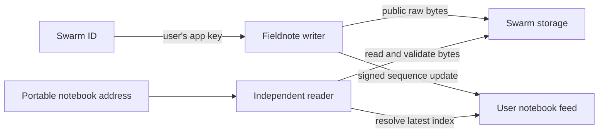

# Fieldnote

A birding notebook whose records travel with you. Sign in with Swarm ID, record a sighting, and open the same notebook in an independently built reader. Public records, photos and the notebook index are stored on Swarm.

- **Writer:** https://fieldnote-sightings-hrsh22.vercel.app
- **Independent reader:** https://fieldnote-reader-hrsh22.vercel.app
- **Format contract:** [format/README.md](format/README.md)
- **Verification status:** [docs/VERIFICATION.md](docs/VERIFICATION.md)

Built for Road To Devcon V, Problem 2: **Take your records with you**. Folio, the Problem 1 project, has a separate repository.

## Try it

1. Open the writer and sign in with Swarm ID. Use its default network settings for the sponsored upload path; a personal stamp or local Bee process is not required.
2. Record a species, observation date, place, coordinates and coordinate uncertainty. Time, notes and a JPEG, PNG or WebP photo are optional.
3. Save. Fieldnote checks your current upload capability before every write and verifies the uploaded content before confirming the notebook update.
4. Select **Open in another reader**. The second application fetches the descriptor, signed feed, index, records and photo directly from Swarm, without signing in or importing a file.
5. Bookmark that reader link. It resolves the latest notebook index, so subsequent sightings appear at the same address.

Sightings and coordinates are public. Use approximate locations for sensitive species. Demonstration records are labeled. Sponsored storage has no client-visible retention guarantee.

## Run locally

Use Node.js 22 and npm.

```sh
npm ci
npm run dev
# In another terminal:
npm run dev:reader
```

Writer: `http://127.0.0.1:3001`. Reader: `http://127.0.0.1:4174`.

No application secret or environment file is required. For a local reader link, optionally set `NEXT_PUBLIC_READER_URL=http://127.0.0.1:4174` in `apps/fieldnote/.env.local`. A Swarm ID app key is derived per origin: local and deployed writers have different notebooks even when using the same identity. Keep the production writer origin stable.

```sh
npm test
npm run typecheck
npm run check:boundaries
npm run check:secrets
npm run build
```

## Two independent applications

| Path             | Technology                                                | Responsibility                                                                        |
| ---------------- | --------------------------------------------------------- | ------------------------------------------------------------------------------------- |
| `apps/fieldnote` | Next.js, TypeScript, React, shadcn-style Radix components | Identity, sighting form, guarded publishing, notebook browsing                        |
| `apps/reader`    | TypeScript, native DOM, esbuild                           | Independent format validation, retrieval, table, filters, photos and network evidence |
| `format`         | Markdown and JSON Schema                                  | Portable v1 wire format and examples                                                  |
| `tests`          | Node test runner                                          | Publication failure paths and cross-implementation contract checks                    |

The reader has its own package manifest, lockfile, build root, parser, network code and renderer. It imports no writer modules or shared executable schemas. Build it independently with `npm ci && npm run build` from `apps/reader`, including when the writer directory is absent. Each application deploys to a separate Vercel project from its own root.



An immutable address descriptor contains the publishing owner and topic. A signed sequence feed points to an immutable notebook index. That index references self-describing sighting records, which may reference a photo. All content uploads and downloads use the raw `/bytes` endpoint family. No pin, tag or ACT options are sent to the subsidised gateway.

The stored notebook is authoritative. Browser storage only retains an unsaved form draft. A failed request cannot silently become an empty notebook. Writes are serialized within the browser, check for an updated feed before publishing, and reconcile an uncertain response by reading the feed.

## Rubric map

| Requirement                                     | Reviewable implementation                                                                                                                   |
| ----------------------------------------------- | ------------------------------------------------------------------------------------------------------------------------------------------- |
| Check `canUpload` before every write            | [`publish.ts`](apps/fieldnote/src/lib/publish.ts), publication tests                                                                        |
| Default path without a personal stamp           | Swarm ID subsidised gateway configuration in [`fieldnote.tsx`](apps/fieldnote/src/components/fieldnote.tsx); live verification status below |
| Format identifier and version in actual objects | [`format.ts`](apps/fieldnote/src/lib/format.ts), [wire specification](format/README.md), contract tests                                     |
| Independent reader                              | [`apps/reader`](apps/reader), build dependency boundary check                                                                               |
| Matching raw endpoint family                    | Writer and reader network modules use `/bytes` for records and photos                                                                       |
| No pin/tag gateway options                      | Upload option allowlist and publication assertions                                                                                          |
| Specific visible errors                         | Capability, identity change, conflict, timeout, malformed object, version and integrity errors                                              |
| Credentials excluded                            | Ignored local runtime directory, source secret scan, CI scan                                                                                |

## Practical limits

- One active publishing session per notebook. Browser locks and a pre-publication conflict check do not provide distributed multi-writer consensus.
- Public notebooks, up to 1,000 sightings; each photo up to 5 MiB. This version creates records and does not edit or delete published observations.
- The species picker is a small starter list with manual entry, not a complete taxonomy database.
- Feed owner authentication proves the publishing key, not a person's legal identity or the truth of an observation. SHA-256 checks verify content against the index; readers rely on the selected Swarm gateway and SDK for network resolution.
- A public reference does not guarantee perpetual availability. The reader accepts another HTTPS gateway if its default gateway is unavailable.

See [verification notes](docs/VERIFICATION.md) for the distinction between automated checks and completed live tests. No official judging score is claimed.
