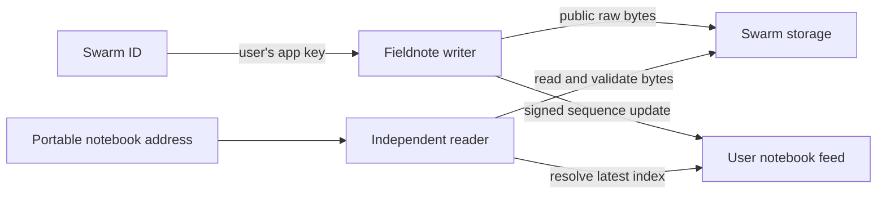

# Fieldnote

[Latest strict Loops rubric review](docs/STRICT_EVALUATION.md) - all eight technical checks, the twenty-point criterion and concrete follow-up findings.

[Implementation CI and deployment verification](evidence/release-verification.json)
[Repository evaluation and all eight published checks](docs/REPOSITORY_REVIEW.md) - source paths, tests, committed evidence and reproduction commands.

A birding notebook whose records travel with you. Sign in with Swarm ID, record a sighting, and open the same notebook in an independently built reader. Public records, photos and the notebook index are stored on Swarm.

- **Format contract:** [format/README.md](format/README.md)
- **Verification status:** [docs/VERIFICATION.md](docs/VERIFICATION.md)
- **Real network evidence:** [evidence/](evidence/)
- **Loops evaluator review:** [docs/LOOPS_EVALUATION.md](docs/LOOPS_EVALUATION.md)

Built for Road To Devcon V, Problem 2: **Take your records with you**. Folio, the Problem 1 project, has a separate repository.

## Review in GitHub

1. Read the [criterion-by-criterion source map](docs/REPOSITORY_REVIEW.md), including the qualitative review and implementation evidence.
2. Follow the normal data path: [writer loads from Swarm](apps/fieldnote/src/lib/network.ts), [guarded publication](apps/fieldnote/src/lib/publish.ts), and the [separate reader](apps/reader/src). The reader uses its own parser and network implementation.
3. Inspect the [published format](format/README.md), [exact stored JSON objects](evidence/objects/) and [object manifest](evidence/objects-manifest.json). The records are self-describing without application lookup tables.
4. Inspect [publication failure tests](tests/publication.test.ts), [independent contract tests](tests/reader-contract.test.ts), [draft recovery tests](tests/draft.test.ts), and [GitHub Actions](https://github.com/hrsh22/fieldnote-sightings/actions). CI builds the reader with the writer tree absent.
5. Read the [completed verification record](docs/VERIFICATION.md) and [retry-safety evidence](evidence/retry-safety-review.json). They distinguish actual network observations from controlled automated failure tests.

Sightings and coordinates are public. Use approximate locations for sensitive species. Demonstration records are labeled. The [format contract](format/README.md) specifies publication, identity and storage semantics.

## Two independent applications

| Path             | Technology                                                | Responsibility                                                                        |
| ---------------- | --------------------------------------------------------- | ------------------------------------------------------------------------------------- |
| `apps/fieldnote` | Next.js, TypeScript, React, shadcn-style Radix components | Identity, sighting form, guarded publishing, notebook browsing                        |
| `apps/reader`    | TypeScript, native DOM, esbuild                           | Independent format validation, retrieval, table, filters, photos and network evidence |
| `format`         | Markdown and JSON Schema                                  | Portable v1 wire format and examples                                                  |
| `tests`          | Node test runner                                          | Publication failure paths and cross-implementation contract checks                    |

The reader has its own package manifest, lockfile, build root, parser, network code and renderer. It imports no writer modules or shared executable schemas. Build it independently with `npm ci && npm run build` from `apps/reader`, including when the writer directory is absent. Each application deploys to a separate Vercel project from its own root.

An immutable address descriptor contains the publishing owner and topic. A signed sequence feed points to an immutable notebook index. That index references self-describing sighting records, which may reference a photo. All content uploads and downloads use the raw `/bytes` endpoint family. No pin, tag or ACT options are sent to the subsidised gateway.

The stored notebook is authoritative. Browser storage only retains an unsaved form draft. A failed request cannot silently become an empty notebook. Writes are serialized within the browser, check for an updated feed before publishing, and reconcile an uncertain response by reading the feed.

Each draft keeps a stable sighting ID. If a success response is lost, saving that draft again checks the network for its earlier record and verifies the exact details and photo before returning success, without adding another sighting. An edited retry is kept for review rather than silently replacing the saved version. Reloaded drafts identify a missing selected photo and require reattachment or an explicit choice to continue without it. If browser storage is unavailable, the form warns that the draft survives only while the window stays open. [Retry safety checks](evidence/retry-safety-review.json).

## Rubric map

| Requirement                                     | Reviewable implementation                                                                                                                   |
| ----------------------------------------------- | ------------------------------------------------------------------------------------------------------------------------------------------- |
| Check `canUpload` before every write            | [`publish.ts`](apps/fieldnote/src/lib/publish.ts), publication tests                                                                        |
| Default path without a personal stamp           | Swarm ID subsidised gateway configuration in [`fieldnote.tsx`](apps/fieldnote/src/components/fieldnote.tsx); live verification status below |
| Format identifier and version in actual objects | [`format.ts`](apps/fieldnote/src/lib/format.ts), [wire specification](format/README.md), contract tests                                     |
| Independent reader                              | [`apps/reader`](apps/reader), build dependency boundary check                                                                               |
| Matching raw endpoint family                    | Writer and reader network modules use `/bytes` for records and photos                                                                       |
| No pin/tag gateway options                      | Upload option allowlist and publication assertions                                                                                          |
| Specific visible errors                         | Capability, identity change, conflict, timeout, malformed object, version and integrity errors                                              |
| Credentials excluded                            | Ignored local runtime directory, source secret scan, CI scan                                                                                |

See [verification notes](docs/VERIFICATION.md) for the distinction between automated checks and completed live tests. No official judging score is claimed.

## Optional application links

[Writer](https://fieldnote-sightings-hrsh22.vercel.app) · [Independent reader](https://fieldnote-reader-hrsh22.vercel.app) · [Public demonstration notebook](https://fieldnote-reader-hrsh22.vercel.app/#notebook=b624c672831973e1ddcbce3b75f6f18d9dba31febca86d50fd11a966051cdba8).

[Application use and development instructions](docs/DEVELOPMENT.md) are separate from the repository review. The review path above links directly to the submitted implementation and evidence.
